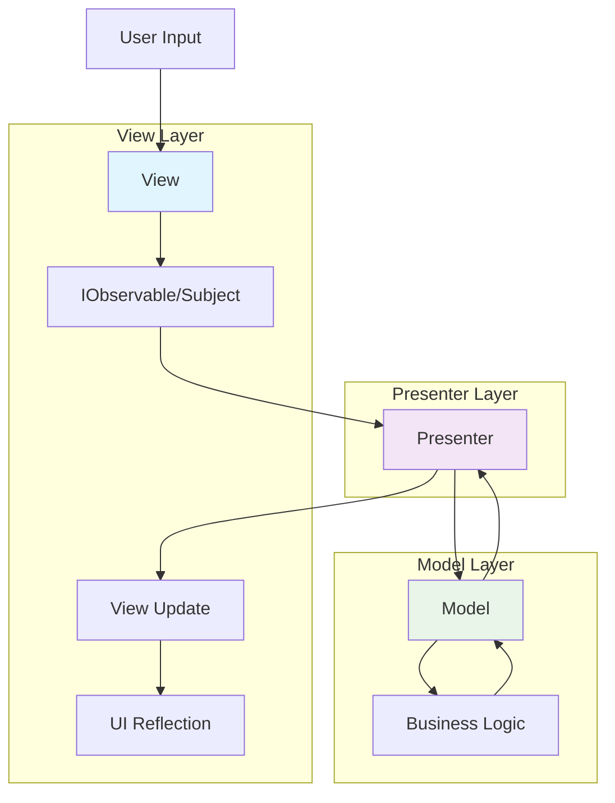

# TiOKawa コーディングルール

## MVPアーキテクチャについて

TiOKawaは**MVP（Model-View-Presenter）**アーキテクチャパターンを採用しています。これは以下の3つのレイヤーで構成される設計パターンです：

- **Model**: ビジネスロジックとデータの管理を担当
- **View**: ユーザーインターフェースとユーザーからの入力を担当
- **Presenter**: ModelとViewの仲介役として、データの流れと処理を制御

このパターンにより、各レイヤーの責務が明確に分離され、保守性と拡張性の高いコードを実現できます。

## 各レイヤーの実装ルール

### Model

**基本原則:**
- `MonoBehaviour`の継承を**禁止**
- ビジネスロジックとデータの状態管理に専念
- Unityのライフサイクルに依存しない純粋なC#クラスとして実装

**実装例:**
```csharp
// ✅ 正しい実装
public class PlayerModel 
{
    public int Health { get; private set; }
    public void TakeDamage(int damage) { /* logic */ }
}

// ❌ 間違った実装
public class PlayerModel : MonoBehaviour // MonoBehaviour継承は禁止
{
    // ...
}
```

### Presenter

**基本原則:**
- 本来`MonoBehaviour`継承は禁止だが、TiOKawaでは`MonoPresenter`を継承することが**必須**
- 基本的にScene一つにつき一つのPresenterを配置
- Scene内のViewを`SerializeField`で保持
- `SetupModel()`メソッド内で使用するModelを作成・初期化
- オブザーバーパターンでViewを監視し、ModelとViewの橋渡しを行う

**実装ルール:**
```csharp
public class GamePresenter : MonoPresenter
{
    [SerializeField] PlayerView playerView;  // ViewをSerializeFieldで保持
    [SerializeField] EnemyView enemyView;
    
    private PlayerModel playerModel;
    private EnemyModel enemyModel;

    protected override void SetupModel()
    {
        // Modelの作成・初期化
        playerModel = new PlayerModel();
        enemyModel = new EnemyModel();
    }

    protected override void SubscribeView()
    {
        // Viewの監視（オブザーバーパターン）
        playerView.OnAttack.Subscribe(attack => {
            playerModel.Attack(attack);
        });
    }
}
```

### View

**基本原則:**
- `MonoView`を継承することが**必須**
- `Awake()`, `Start()`, `Update()`は基本的に使用しない
- `IObservable`、`Subject`を用いてオブザーバーパターンの起点となる
- ユーザーインタラクションを`IObservable`として公開

**実装ルール:**
```csharp
public class PlayerView : MonoView
{
    private readonly Subject<AttackData> onAttack = new();
    public IObservable<AttackData> OnAttack => onAttack;

    // UI操作時に呼び出される
    public void OnAttackButtonClicked()
    {
        var attackData = new AttackData(/* parameters */);
        onAttack.OnNext(attackData);
    }

    void OnDestroy()
    {
        onAttack.Dispose(); // リソースの解放
    }
}
```

## 処理フロー図



## まとめ

- **Model**: MonoBehaviour継承禁止、純粋なビジネスロジック
- **Presenter**: MonoPresenter継承必須、Scene毎に一つ、ModelとViewの仲介
- **View**: MonoView継承必須、IObservable/Subjectでイベント発信

このルールに従うことで、各レイヤーの責務が明確に分離され、テスタブルで保守性の高いUnityアプリケーションを構築できます。