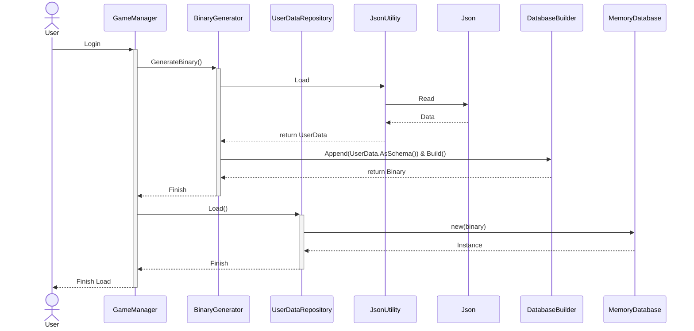
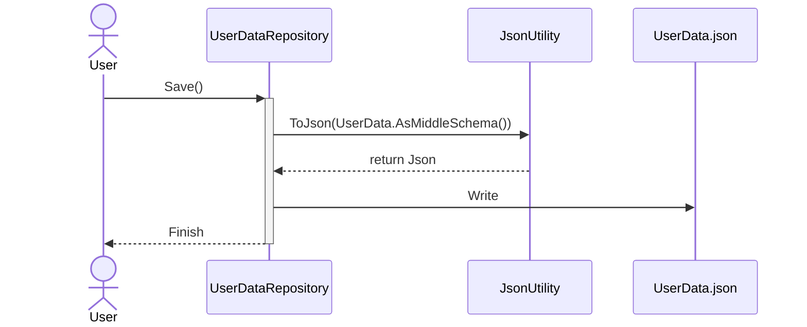

# DataManagement
データの管理方法について

## MasterData

## UserData
ユーザーデータは基本的にJsonでローカルに保存することとする。
理由は以下の通り
* クラウド環境への保存は金銭的コストがかかる
* 実装が比較的楽
* テキストファイルから視覚的に内容が把握できる
### Load
ログイン時に一括でユーザーデータをロードする。

### Save
ユーザーデータの更新が入るたびにセーブする
