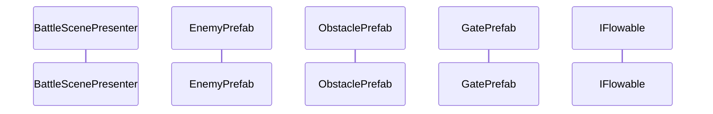
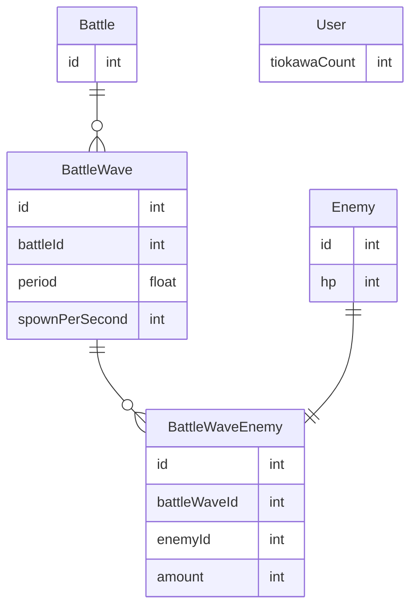

# インゲーム設計

## 機能要件
ラストウォーライクなカジュアルゲーム

コースのギミックを用いて強化しつつ敵を倒し、ゴールまで到達することを目指す

### ゴール要件
* ボスを倒す
* ゴール地点に到達する

### コースギミック
* エネミー
  * 後で詳しく記述する
* 障害物
  * 木箱等
  * 当たったちおかわは死亡する
* ゲート
  * 「+2」「×3」「-10」等が書いてある
  * 書いてある内容に応じて味方の数が増減する

### エネミー
* ボスとモブの2種類
  * ちおかわの体当たりでダメージを受ける
    * ちおかわ1体で1ダメージ
* モブ
  * 道中にいる雑魚敵
  * 基本1,2ダメで倒せることを想定
* ボス
  * 道中で少し効率良くやらないと倒せないレベルを想定
  * 攻撃を行う
    * あたったちおかわは死亡

### プレイヤー
* 操作はちおかわの左右の移動のみ
* 攻撃はオート

## 機能設計
機能一覧
* エネミー/障害物のスポーン
* エネミー/障害物の移動
* エネミー攻撃処理
* 障害物衝突処理
* ゲートのスポーン
* ゲート通過処理
* ちおかわ増減処理
* ゴール判定

## 処理フロー
### エネミー/障害物/ゲートのスポーン

## DB設計
