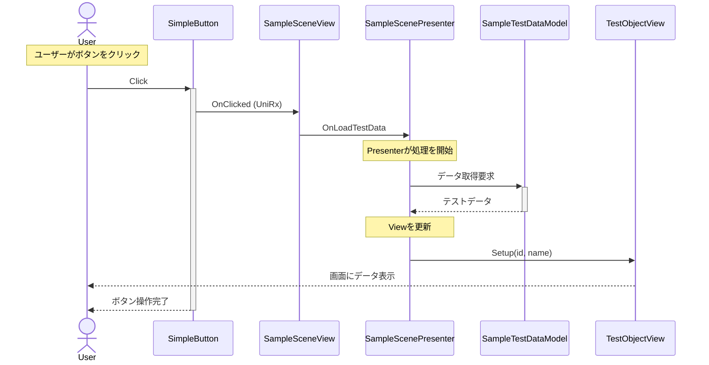
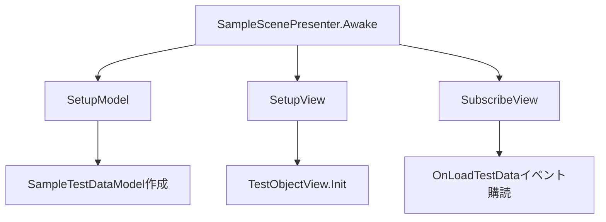
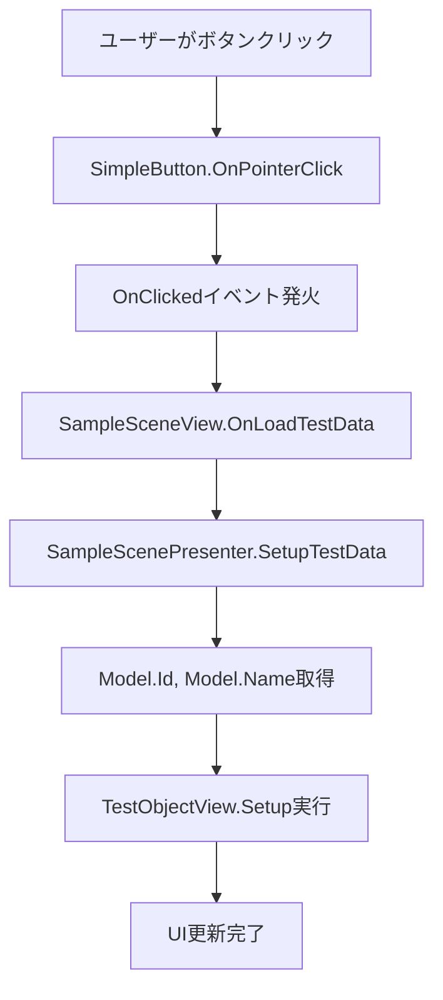

# サンプルフローの解説

このドキュメントでは、`Assets/TiOKawa/Scenes/Sample`に実装されているサンプルフローについて解説します。
Unity初心者向けに、MVP（Model-View-Presenter）パターンを使用した基本的な処理フローを説明します。

## 概要

サンプルフローでは以下の基本的な処理の流れを実装しています：

1. **ボタンクリック**: ユーザーがボタンを押す
2. **イベント発火**: ボタンクリックイベントが発生
3. **Presenter処理**: イベントを受け取り、Modelからデータを取得
4. **View更新**: 取得したデータでViewを更新

## アーキテクチャパターン：MVP

このサンプルでは**MVP（Model-View-Presenter）パターン**を採用しています。

### MVPパターンとは

- **Model**: データとビジネスロジックを担当
- **View**: UI表示とユーザー入力を担当  
- **Presenter**: ViewとModelを繋ぐ橋渡し役

### MVPパターンの利点

- **責任の分離**: 各レイヤーの責任が明確
- **テストしやすさ**: Presenterのロジックを単体テストで検証可能
- **保守性**: コードの変更が他の部分に影響しにくい
- **再利用性**: ModelとPresenterは他のViewでも再利用可能

## 処理フロー図



## コンポーネント詳細解説

### 1. View層

#### SimpleButton
```csharp
// ボタンの基本機能を提供
public class SimpleButton : ButtonBase, IPointerDownHandler, IPointerUpHandler
```

**役割**: 
- ユーザーのクリック操作を検知
- クリック時のビジュアルフィードバック（明度変更）
- UniRxを使ったイベント通知

**重要な機能**:
- `OnPointerDown/Up`: クリック時の視覚的フィードバック
- `ButtonBase`から継承した`OnClicked`イベント

#### SampleSceneView
```csharp
public class SampleSceneView : MonoView
{
    [SerializeField] SimpleButton button;
    public IObservable<Unit> OnLoadTestData => button.OnClicked;
}
```

**役割**:
- UI要素（ボタン）の管理
- PresenterへのイベントBridge
- UniRxによるリアクティブプログラミング

#### TestObjectView
```csharp
public class TestObjectView : MonoView
{
    public void Setup(int id, string name)
    {
        idText.text = $"ID: {id:00}";
        nameText.text = $"Name: {name}";
    }
}
```

**役割**:
- データの表示
- UI要素の初期化
- Presenterからのデータ受け取り

### 2. Presenter層

#### SampleScenePresenter
```csharp
public class SampleScenePresenter : MonoPresenter
{
    protected override void SubscribeView()
    {
        sampleSceneView.OnLoadTestData.Subscribe(SetupTestData);
    }
}
```

**役割**:
- ViewとModelを繋ぐ調整役
- イベントの購読と処理
- データフローの制御

**ライフサイクル**:
1. `SetupModel()`: Modelの初期化
2. `SetupView()`: Viewの初期化
3. `SubscribeView()`: Viewイベントの購読開始

### 3. Model層

#### SampleTestDataModel
```csharp
public class SampleTestDataModel
{
    public int Id { get; private set; }
    public string Name { get; private set; }
    
    public SampleTestDataModel()
    {
        // サンプルデータとしてハードコーディング
        Id = 1;
        Name = "Sample Test Data";
    }
}
```

**役割**:
- ビジネスデータの保持と管理
- データの整合性保証
- サンプル実装では固定値を提供

## 実際の動作手順

### 1. 初期化フェーズ（Awake時）


### 2. ユーザー操作フェーズ（ボタンクリック時）


## 使用技術

### UniRx（Reactive Extensions）
- **用途**: イベント処理のリアクティブプログラミング
- **利点**: 非同期処理の簡潔な記述、イベントチェーンの管理
- **使用場所**: ボタンクリックイベントの通知

### TextMeshPro
- **用途**: 高品質なテキスト表示
- **使用場所**: IDとNameの表示

## 学習ポイント

### Unity初心者向けのポイント

1. **責任分離の重要性**
   - UIロジックとビジネスロジックを分離
   - テストしやすく、保守しやすいコード

2. **リアクティブプログラミング**
   - UniRxによるイベント駆動開発
   - 非同期処理の直感的な記述

3. **MonoBehaviourの活用**
   - Unityのライフサイクルとの統合
   - インスペクターでのコンポーネント設定

4. **データフローの理解**
   - 一方向データフロー（View → Presenter → Model → View）
   - 状態管理の明確化

## 実践的な応用例

このサンプルフローは以下のような場面で応用できます：

- **設定画面**: ボタンで設定値を変更
- **インベントリ**: アイテムクリックで詳細表示
- **メニューシステム**: メニュー選択で画面遷移
- **データ表示**: リストからアイテム選択で詳細表示

## まとめ

このサンプルフローは、Unityにおける基本的なMVPパターンの実装例です。
シンプルながらも実践的な構造により、スケーラブルで保守性の高いアプリケーション開発の基礎を学ぶことができます。

実際のゲーム開発では、このパターンを応用して複雑な機能を実装していくことになります。
まずはこのサンプルを理解し、自分なりに拡張してみることをお勧めします。