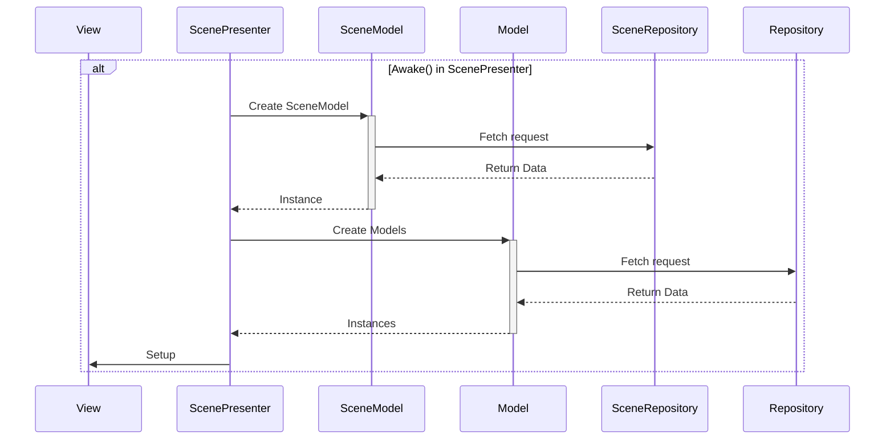

# SceneSetupFlow
新規Sceneをロードする際の処理フローを記述する

```mermaid
sequenceDiagram
    participant View
    participant ScenePresenter
    participant SceneModel
    participant Model
    participant SceneRepository
    participant Repository
    
    alt Awake() in ScenePresenter
        ScenePresenter->>+SceneModel: Create SceneModel
        SceneModel->>SceneRepository: Fetch request
        SceneRepository-->>SceneModel: Return Data
        SceneModel-->>-ScenePresenter: Instance
        ScenePresenter->>+Model: Create Models
        Model->>Repository: Fetch request
        Repository-->>Model: Return Data
        Model-->>-ScenePresenter: Instances
        ScenePresenter->>View: Setup
    end
```